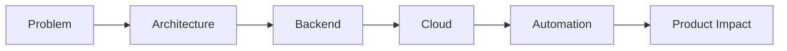

<div align="center">
  
</div>

<div align="center">
  
</div>

<div align="center">
  <a href="https://github.com/nitesh1741">
    
  </a>
  <a href="https://www.linkedin.com/in/niteshkrmehta/">
    
  </a>
  <a href="mailto:nitesh1741@gmail.com">
    
  </a>
</div>

<div align="center">
  
  
  
</div>

<p align="center">
  <a href="#portfolio-snapshot">Snapshot</a> |
  <a href="#featured-work">Featured Work</a> |
  <a href="#stack-matrix">Stack Matrix</a> |
  <a href="#github-telemetry">GitHub Telemetry</a> |
  <a href="#connect">Connect</a>
</p>

---

## Portfolio Snapshot

```yaml
name: Nitesh Kumar Mehta
role: Software Engineer @ CHUBB
specialization:
  - scalable backend systems
  - cloud-native architecture
  - AI-assisted product engineering
current_build:
  - LoksewaGeeks -> an education platform for Loksewa aspirants in Nepal
highlights:
  - Excellence Award at CHUBB (Q3 2024)
  - 3000+ coding problems solved
  - Google Kick Start global rank: 1512
engineering_style:
  - clean design
  - production-first thinking
  - performance with maintainability
```

<table>
  <tr>
    <td width="33%" valign="top">
      <h3>What I Do</h3>
      <p>I build backend-heavy products that are reliable under pressure, maintainable over time, and shaped for real users rather than demo environments.</p>
    </td>
    <td width="33%" valign="top">
      <h3>What I Optimize</h3>
      <p>Architecture clarity, system performance, developer velocity, and practical use of AI where it improves execution instead of adding noise.</p>
    </td>
    <td width="33%" valign="top">
      <h3>What Drives Me</h3>
      <p>Turning difficult product problems into elegant systems, especially where backend engineering, cloud infrastructure, and applied intelligence intersect.</p>
    </td>
  </tr>
</table>

---

## Featured Work

<table>
  <tr>
    <td width="50%" valign="top">
      <h3>LoksewaGeeks</h3>
      <p>Education platform built to help students in Nepal prepare for Loksewa exams with a product mindset focused on accessibility, scale, and meaningful learning outcomes.</p>
      <p>
        
        
        
      </p>
      <p><strong>Focus:</strong> product architecture, backend services, platform reliability</p>
    </td>
    <td width="50%" valign="top">
      <h3>Agentic AI Workspace</h3>
      <p>An experimental environment for autonomous agents, reasoning workflows, and AI-assisted engineering patterns that aim to move from novelty to practical capability.</p>
      <p>
        
        
        
      </p>
      <p><strong>Focus:</strong> agent tooling, orchestration, prompt-driven development</p>
    </td>
  </tr>
</table>

<div align="center">
  
</div>

---

## Stack Matrix

<div align="center">
  
</div>

<table>
  <tr>
    <td width="25%" valign="top">
      <h3>Languages</h3>
      <p>Java, Python, C++, JavaScript, TypeScript</p>
    </td>
    <td width="25%" valign="top">
      <h3>Backend</h3>
      <p>Spring Boot, Django, FastAPI, Node.js, REST services</p>
    </td>
    <td width="25%" valign="top">
      <h3>Cloud</h3>
      <p>AWS, Azure, Docker, Kubernetes, CI/CD pipelines</p>
    </td>
    <td width="25%" valign="top">
      <h3>Data</h3>
      <p>PostgreSQL, MongoDB, MySQL, Redis</p>
    </td>
  </tr>
</table>

---

## Engineering DNA

<div align="center">
  <table>
    <tr>
      <td width="33%" valign="top">
        <h3>Reliability First</h3>
        <p>I prefer systems that stay understandable as they grow. Scale matters, but operational clarity matters just as much.</p>
      </td>
      <td width="33%" valign="top">
        <h3>Speed With Structure</h3>
        <p>I like moving fast through strong abstractions, good defaults, and disciplined implementation rather than through shortcuts that age badly.</p>
      </td>
      <td width="33%" valign="top">
        <h3>AI With Rigor</h3>
        <p>I am interested in AI that improves engineering leverage in production workflows, not AI that only looks impressive in screenshots.</p>
      </td>
    </tr>
  </table>
</div>



---

## GitHub Telemetry

<div align="center">
  
  
</div>

<div align="center">
  
  
</div>

<div align="center">
  
</div>

<div align="center">
  
</div>

---

## Currently Building

<details open>
  <summary><strong>What I am pushing forward right now</strong></summary>
  <br />

- Building products with strong backend foundations and clean service boundaries.
- Exploring agentic AI workflows that actually help developers ship faster.
- Improving systems through better automation, observability, and design discipline.
- Investing in problem-solving depth through continuous competitive programming and system design practice.

</details>

---

## Connect

<div align="center">
  <a href="mailto:nitesh1741@gmail.com">
    
  </a>
  <a href="https://www.linkedin.com/in/niteshkrmehta/">
    
  </a>
  <a href="https://github.com/nitesh1741">
    
  </a>
</div>

<p align="center">
  <strong>I build software that is meant to survive production, not just impress in a demo.</strong>
</p>

<div align="center">
  
</div>
